---
title: "Pymc3 Logistic Regresion - Breast Cancer"
date: 2019-12-08
tags: [pymc3, classification]
categories: ds

excerpt: "Doing logistic regression in Pymc3"
usemathjax: "true"
---

# Overview
* This analysis is meant for a review of using pymc3 for a Bayesian approach to logistic regression.
* The data that I'll be working with is the [Breast Cancer Coimbra Data Set](https://archive.ics.uci.edu/ml/datasets/Breast+Cancer+Coimbra), which was first analyzed by Patrício, M., Pereira, J., Crisóstomo, J. et al. [\[DOI\]](https://doi.org/10.1186/s12885-017-3877-1)
* Like in the original paper, I'll be building a model to predict the presence of breast cancer.
    * The original paper was primarily focused on seeing _which_ predictors are valuable, not on optimizing accuracy.
    * They concluded that "Resistin and Glucose, taken together with Age and BMI, may be considered a good set of candidates for breast cancer biomarkers"
* In this post I will be focused on using Bayesian models (with pymc3) as opposed to random forests, support vector machines, and traditional (frequentist) logistic regression.


# Setting Things Up


```
%%capture
pip install arviz
```


```
%matplotlib inline
from __future__ import absolute_import
from __future__ import division
from __future__ import print_function

import numpy as np
import pandas as pd
import matplotlib.pyplot as plt
import seaborn as sns
from sklearn.model_selection import train_test_split

import pymc3 as pm
import theano.tensor as T
import theano

raw_df = pd.read_csv('https://archive.ics.uci.edu/ml/machine-learning-databases/00451/dataR2.csv', 
                     names=['age', 'bmi', 'glucose', 'insulin', 'homa', 'leptin', 'adiponectin', 'resistin', 'mcp1', 'classification'],
                     skiprows=1)
```


```
def plot_traces(traces, retain=0, var_names=None):
    # function taken from pymc3 example: https://docs.pymc.io/notebooks/GLM-logistic.html, made minor adjustments by passing along var_names
    '''
    Convenience function:
    Plot traces with overlaid means and values
    '''

    ax = pm.traceplot(traces[-retain:],
                      lines=tuple([(k, {}, v['mean'])
                                   for k, v in pm.summary(traces[-retain:], var_names=var_names).iterrows()]),
                      var_names=var_names)

    for i, mn in enumerate(pm.summary(traces[-retain:], var_names=var_names)['mean']):
        ax[i,0].annotate('{:.2f}'.format(mn), xy=(mn,0), xycoords='data'
                    ,xytext=(5,10), textcoords='offset points', rotation=90
                    ,va='bottom', fontsize='large', color='#AA0022')
```


```
def compare_hist(x, group, data, palette='colorblind'):
    """
    Plots differently-colored and overlapping histograms

    Parameters
    ----------
    x : string
        variable to create histogram for
    group : string
        variable to divide data on
    data : pd.DataFrame
        dataframe to retrieve data from
    palette : string, default 'colorblind'
        seaborn color palette, options are: None, 'deep', 'muted', 'pastel', 'bright', 'dark', and 'colorblind'
    """
    col = sns.color_palette(palette)

    for i,c in enumerate(data[group].unique()):
        temp_df = data[data[group]==c][x]
        plt.hist(temp_df, bins=20, color=col[i], alpha=0.5, label=c)

    plt.ylabel('count')
    plt.xlabel(x)
    plt.legend(loc='best')
    plt.show()
```

# Exploratory Data Analysis
Per the data set listing on UCI's website, the attributes and their units of measurements are as follows:
* Age (years)
* BMI (kg/m2)
* Glucose (mg/dL)
* Insulin (µU/mL)
* HOMA
* Leptin (ng/mL)
* Adiponectin (µg/mL)
* Resistin (ng/mL)
* MCP-1(pg/dL)

* Labels:
    1. Healthy controls
    2. Patients


```
_ = sns.countplot(x='classification', data=raw_df)
```


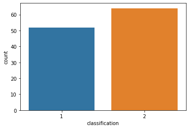


```
for col in raw_df.columns.drop('classification'):
    compare_hist(col, 'classification', raw_df)
```


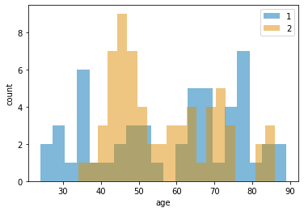


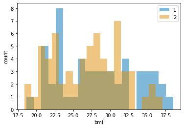


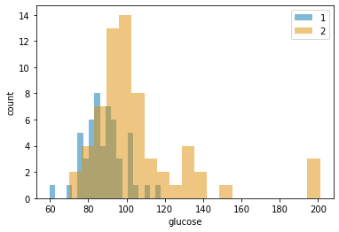


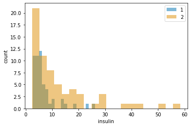


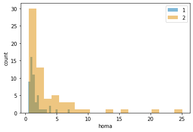


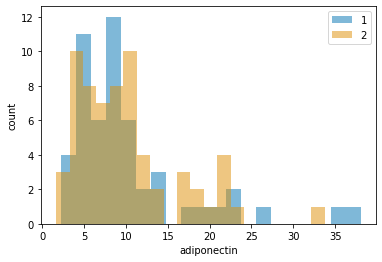


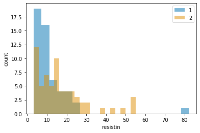


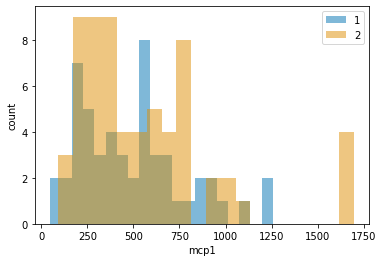


From visual inspection, glucose seems to be the most different variable between the patients and the control group.

# Logistic Regression (with one predictor)

To start off my modeling, I begin with a simple logistic regression based off of one variable: glucose. For review, the equation for logistic regression is as follows: $$f(X)=\frac{1}{1+\exp(-(\alpha+\beta X))}$$  

Where $f(X)$ in our case will be the probability that a patient has breast cancer, and $X$ is the measure of a patient's glucose level. Following Bayesian methodlogy, I use probability distributions to represent my prior beliefs for $\alpha$ and $\beta$.
$$\alpha \sim N(0,10), \beta \sim N(0,10)$$


```
X_train, X_test, y_train, y_test = train_test_split(
    raw_df.drop('classification', axis=1), raw_df[['classification']], test_size=0.3, random_state=420
) # following Patrício, M., Pereira, J., Crisóstomo, J. et al., I set 30% of the data to validate my predictions
```


```
with pm.Model() as pooled_model:
    alpha = pm.Normal('alpha', mu=0, sd=10)
    beta = pm.Normal('beta', mu=0, sd=10)

    glucose = pm.Data('glucose', X_train.glucose.values-X_train.glucose.values.mean())

    mu = alpha + beta * glucose
    theta = pm.math.sigmoid(mu)

    outcome = pm.Bernoulli('outcome', p=theta, observed=(y_train.classification==2).values)

    pooled_trace = pm.sample(5000, tune=5000, init='auto')
```

    Auto-assigning NUTS sampler...
    Initializing NUTS using jitter+adapt_diag...
    Sequential sampling (2 chains in 1 job)
    NUTS: [beta, alpha]
    100%|██████████| 10000/10000 [00:08<00:00, 1152.02it/s]
    100%|██████████| 10000/10000 [00:08<00:00, 1208.62it/s]
    


```
pm.summary(pooled_trace).round(2)
```

    /usr/local/lib/python3.6/dist-packages/pymc3/stats.py:991: FutureWarning: The join_axes-keyword is deprecated. Use .reindex or .reindex_like on the result to achieve the same functionality.
      axis=1, join_axes=[dforg.index])
    


<div>
<style scoped>
    .dataframe tbody tr th:only-of-type {
        vertical-align: middle;
    }

    .dataframe tbody tr th {
        vertical-align: top;
    }

    .dataframe thead th {
        text-align: right;
    }
</style>
<table border="1" class="dataframe">
  <thead>
    <tr style="text-align: right;">
      <th></th>
      <th>mean</th>
      <th>sd</th>
      <th>mc_error</th>
      <th>hpd_2.5</th>
      <th>hpd_97.5</th>
      <th>n_eff</th>
      <th>Rhat</th>
    </tr>
  </thead>
  <tbody>
    <tr>
      <th>alpha</th>
      <td>0.59</td>
      <td>0.30</td>
      <td>0.0</td>
      <td>0.01</td>
      <td>1.17</td>
      <td>5792.30</td>
      <td>1.0</td>
    </tr>
    <tr>
      <th>beta</th>
      <td>0.10</td>
      <td>0.03</td>
      <td>0.0</td>
      <td>0.05</td>
      <td>0.15</td>
      <td>5786.26</td>
      <td>1.0</td>
    </tr>
  </tbody>
</table>
</div>


```
plot_traces(pooled_trace)
```

    /usr/local/lib/python3.6/dist-packages/pymc3/stats.py:991: FutureWarning: The join_axes-keyword is deprecated. Use .reindex or .reindex_like on the result to achieve the same functionality.
      axis=1, join_axes=[dforg.index])
    /usr/local/lib/python3.6/dist-packages/pymc3/stats.py:991: FutureWarning: The join_axes-keyword is deprecated. Use .reindex or .reindex_like on the result to achieve the same functionality.
      axis=1, join_axes=[dforg.index])
    


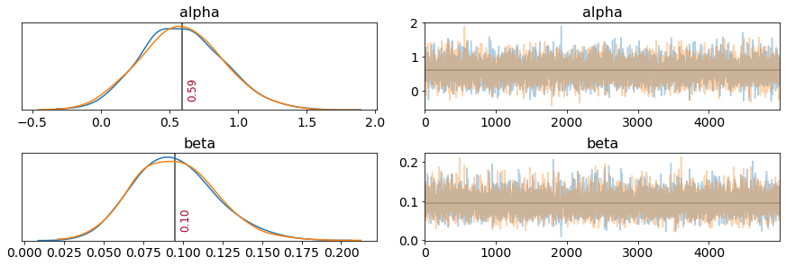


```
WAICs = {} # dictionary containing the WAIC for each different model
WAICs['logreg_glucose'] = pm.waic(pooled_trace, pooled_model).WAIC
```

    /usr/local/lib/python3.6/dist-packages/ipykernel_launcher.py:2: FutureWarning: arrays to stack must be passed as a "sequence" type such as list or tuple. Support for non-sequence iterables such as generators is deprecated as of NumPy 1.16 and will raise an error in the future.
      
    

# Logistic Regression (with the other predictors)


```
for s in X_train.columns:

    with pm.Model() as temp_model:
        alpha = pm.Normal('alpha', mu=0, sd=10)
        beta = pm.Normal('beta', mu=0, sd=10)

        val = pm.Data('val', X_train[s].values-X_train[s].values.mean())

        mu = alpha + beta*val
        theta = pm.math.sigmoid(mu)

        outcome = pm.Bernoulli('outcome', p=theta, observed=(y_train.classification==2).values)

        temp_trace = pm.sample(5000, tune=5000, init='auto')

    WAICs[f'logreg_{s}'] = pm.waic(temp_trace, temp_model).WAIC
```

    Auto-assigning NUTS sampler...
    Initializing NUTS using jitter+adapt_diag...
    Sequential sampling (2 chains in 1 job)
    NUTS: [beta, alpha]
    100%|██████████| 10000/10000 [00:07<00:00, 1343.98it/s]
    100%|██████████| 10000/10000 [00:07<00:00, 1329.57it/s]
    /usr/local/lib/python3.6/dist-packages/ipykernel_launcher.py:16: FutureWarning: arrays to stack must be passed as a "sequence" type such as list or tuple. Support for non-sequence iterables such as generators is deprecated as of NumPy 1.16 and will raise an error in the future.
      app.launch_new_instance()
    Auto-assigning NUTS sampler...
    Initializing NUTS using jitter+adapt_diag...
    Sequential sampling (2 chains in 1 job)
    NUTS: [beta, alpha]
    100%|██████████| 10000/10000 [00:07<00:00, 1334.43it/s]
    100%|██████████| 10000/10000 [00:07<00:00, 1363.83it/s]
    Auto-assigning NUTS sampler...
    Initializing NUTS using jitter+adapt_diag...
    Sequential sampling (2 chains in 1 job)
    NUTS: [beta, alpha]
    100%|██████████| 10000/10000 [00:08<00:00, 1174.72it/s]
    100%|██████████| 10000/10000 [00:08<00:00, 1165.87it/s]
    Auto-assigning NUTS sampler...
    Initializing NUTS using jitter+adapt_diag...
    Sequential sampling (2 chains in 1 job)
    NUTS: [beta, alpha]
    100%|██████████| 10000/10000 [00:08<00:00, 1214.58it/s]
    100%|██████████| 10000/10000 [00:08<00:00, 1241.92it/s]
    /usr/local/lib/python3.6/dist-packages/pymc3/stats.py:219: UserWarning: For one or more samples the posterior variance of the
            log predictive densities exceeds 0.4. This could be indication of
            WAIC starting to fail see http://arxiv.org/abs/1507.04544 for details
            
      """)
    Auto-assigning NUTS sampler...
    Initializing NUTS using jitter+adapt_diag...
    Sequential sampling (2 chains in 1 job)
    NUTS: [beta, alpha]
    100%|██████████| 10000/10000 [00:09<00:00, 1080.24it/s]
    100%|██████████| 10000/10000 [00:08<00:00, 1154.51it/s]
    Auto-assigning NUTS sampler...
    Initializing NUTS using jitter+adapt_diag...
    Sequential sampling (2 chains in 1 job)
    NUTS: [beta, alpha]
    100%|██████████| 10000/10000 [00:08<00:00, 1205.94it/s]
    100%|██████████| 10000/10000 [00:08<00:00, 1181.40it/s]
    Auto-assigning NUTS sampler...
    Initializing NUTS using jitter+adapt_diag...
    Sequential sampling (2 chains in 1 job)
    NUTS: [beta, alpha]
    100%|██████████| 10000/10000 [00:07<00:00, 1299.50it/s]
    100%|██████████| 10000/10000 [00:07<00:00, 1357.78it/s]
    Auto-assigning NUTS sampler...
    Initializing NUTS using jitter+adapt_diag...
    Sequential sampling (2 chains in 1 job)
    NUTS: [beta, alpha]
    100%|██████████| 10000/10000 [00:08<00:00, 1223.51it/s]
    100%|██████████| 10000/10000 [00:07<00:00, 1275.13it/s]
    Auto-assigning NUTS sampler...
    Initializing NUTS using jitter+adapt_diag...
    Sequential sampling (2 chains in 1 job)
    NUTS: [beta, alpha]
    100%|██████████| 10000/10000 [00:10<00:00, 947.84it/s]
    100%|██████████| 10000/10000 [00:09<00:00, 1037.26it/s]
    


```
WAICs
```


    {'logreg_adiponectin': 115.79012405006857,
     'logreg_age': 114.06030465521563,
     'logreg_bmi': 115.52257553407975,
     'logreg_glucose': 92.93625741087507,
     'logreg_homa': 104.65831464045651,
     'logreg_insulin': 107.32761655727992,
     'logreg_leptin': 115.59758252972703,
     'logreg_mcp1': 113.21041037732438,
     'logreg_resistin': 114.47079888475751}


For the univariate models, the WAIC suggests that the logistic regression model with glucose as the predictor performs best. However, it's unlikely that this is the best model that can be created with the data given. Bayesian methodology provides me a fun tool to improve my model: hierarchical modeling.

# Hierarchical Model

 Recall the formula for logistic regression: $$f(X)=\frac{1}{1+\exp(-(\alpha+\beta X))}$$  

In our previous models, it's assumed that glucose has an equal effect, $\beta$, on the odds of cancer for all subjects. However, I think that depending on factors such as age or BMI, $\beta$ should vary. My first approach is to create groups based on a person's BMI and age, and for each group $i$, there will be a distinct value for $\beta_i$. There are two ways in which I can model the $\beta_i$'s: each $\beta_i$ can be independent of other, or they can come from a common distribution. I choose the latter, and thus define my prior belief for the $\beta_i$'s as follows:  
$$\beta_{i} \sim N(\mu_{\beta}, \sigma_{\beta}))$$
$$\mu_{\beta} \sim N(0,10), \sigma_{\beta} \sim HalfCauchy(10)$$


```
def agebmi_group(age, bmi):
    """
    Assigns a group based off a patient's bmi and age

    Parameters
    ----------
    age : int
        patient's age
    bmi : float
        patient's bmi
 

    Returns
    -------
    int in [0,1,2,3], matching whether a person is young-underweight, young-overweight, old-overweight, or old-overweight
    """
    if bmi < 25.0:
        if age < 50:
            return 0
        elif age >= 50:
            return 1
    elif bmi >= 25.0:
        if age < 50:
            return 2
        elif age >= 50:
            return 3
```


```
X_train['agebmi_group'] = X_train[['age', 'bmi']].apply((lambda x: agebmi_group(x.age, x.bmi)), axis=1)
```


```
X_train['glucose_c'] = (X_train['glucose'] - X_train['glucose'].mean()).astype(int)
```


```
# would like to use pm.Data instead, but currently it autocasts values to float, so can't use values for indexing
model_2_input = theano.shared(np.array(X_train[['agebmi_group', 'glucose_c']]))
model_2_output = theano.shared(np.array(y_train['classification'] == 2))
```


```
# hierarchical model 
with pm.Model() as hierarchical_model_0:
    alpha = pm.Normal('alpha', mu=0., sigma=10.)

    mu_beta = pm.Normal('mu_beta', mu=0., sigma=10.)
    sigma_beta = pm.HalfCauchy('sigma_beta', beta=10.)
    beta = pm.Normal('beta', mu=mu_beta, sigma=sigma_beta, shape=4)

    mu = alpha + beta[model_2_input[:,0]] * model_2_input[:,1]
    theta = pm.math.sigmoid(mu)

    outcome = pm.Bernoulli('outcome', p=theta, observed=model_2_output)

    hierarchical_trace_0 = pm.sample(5000, tune=5000, init='adapt_diag', target_accept=0.9)
```

    Auto-assigning NUTS sampler...
    Initializing NUTS using adapt_diag...
    Sequential sampling (2 chains in 1 job)
    NUTS: [beta, sigma_beta, mu_beta, alpha]
    100%|██████████| 10000/10000 [00:43<00:00, 228.14it/s]
    100%|██████████| 10000/10000 [00:39<00:00, 251.31it/s]
    There were 351 divergences after tuning. Increase `target_accept` or reparameterize.
    The acceptance probability does not match the target. It is 0.8293464414779969, but should be close to 0.9. Try to increase the number of tuning steps.
    There were 428 divergences after tuning. Increase `target_accept` or reparameterize.
    The number of effective samples is smaller than 10% for some parameters.
    


```
pm.summary(hierarchical_trace_0).round(2)
```

    /usr/local/lib/python3.6/dist-packages/pymc3/stats.py:991: FutureWarning: The join_axes-keyword is deprecated. Use .reindex or .reindex_like on the result to achieve the same functionality.
      axis=1, join_axes=[dforg.index])
    


<div>
<style scoped>
    .dataframe tbody tr th:only-of-type {
        vertical-align: middle;
    }

    .dataframe tbody tr th {
        vertical-align: top;
    }

    .dataframe thead th {
        text-align: right;
    }
</style>
<table border="1" class="dataframe">
  <thead>
    <tr style="text-align: right;">
      <th></th>
      <th>mean</th>
      <th>sd</th>
      <th>mc_error</th>
      <th>hpd_2.5</th>
      <th>hpd_97.5</th>
      <th>n_eff</th>
      <th>Rhat</th>
    </tr>
  </thead>
  <tbody>
    <tr>
      <th>alpha</th>
      <td>0.70</td>
      <td>0.30</td>
      <td>0.01</td>
      <td>0.13</td>
      <td>1.33</td>
      <td>2884.39</td>
      <td>1.0</td>
    </tr>
    <tr>
      <th>mu_beta</th>
      <td>0.14</td>
      <td>0.15</td>
      <td>0.00</td>
      <td>-0.12</td>
      <td>0.43</td>
      <td>830.58</td>
      <td>1.0</td>
    </tr>
    <tr>
      <th>beta__0</th>
      <td>0.15</td>
      <td>0.06</td>
      <td>0.00</td>
      <td>0.04</td>
      <td>0.28</td>
      <td>1398.29</td>
      <td>1.0</td>
    </tr>
    <tr>
      <th>beta__1</th>
      <td>0.24</td>
      <td>0.14</td>
      <td>0.00</td>
      <td>0.05</td>
      <td>0.52</td>
      <td>673.85</td>
      <td>1.0</td>
    </tr>
    <tr>
      <th>beta__2</th>
      <td>0.09</td>
      <td>0.04</td>
      <td>0.00</td>
      <td>0.01</td>
      <td>0.18</td>
      <td>4455.57</td>
      <td>1.0</td>
    </tr>
    <tr>
      <th>beta__3</th>
      <td>0.08</td>
      <td>0.03</td>
      <td>0.00</td>
      <td>0.02</td>
      <td>0.15</td>
      <td>2936.70</td>
      <td>1.0</td>
    </tr>
    <tr>
      <th>sigma_beta</th>
      <td>0.18</td>
      <td>0.28</td>
      <td>0.01</td>
      <td>0.01</td>
      <td>0.57</td>
      <td>875.00</td>
      <td>1.0</td>
    </tr>
  </tbody>
</table>
</div>


```
_ = pm.traceplot(hierarchical_trace_0)
```


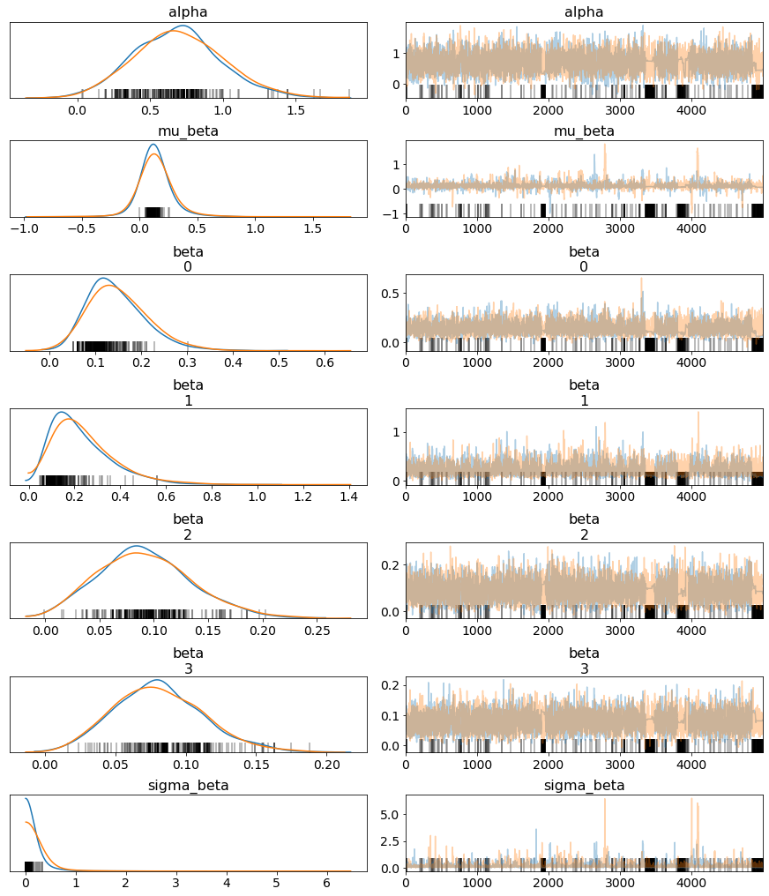


```
WAICs['hierch_0'] = pm.waic(hierarchical_trace_0, hierarchical_model_0).WAIC
```

    /usr/local/lib/python3.6/dist-packages/ipykernel_launcher.py:1: FutureWarning: arrays to stack must be passed as a "sequence" type such as list or tuple. Support for non-sequence iterables such as generators is deprecated as of NumPy 1.16 and will raise an error in the future.
      """Entry point for launching an IPython kernel.
    /usr/local/lib/python3.6/dist-packages/pymc3/stats.py:219: UserWarning: For one or more samples the posterior variance of the
            log predictive densities exceeds 0.4. This could be indication of
            WAIC starting to fail see http://arxiv.org/abs/1507.04544 for details
            
      """)
    


```
WAICs
```


    {'hierch_0': 93.1185868207544,
     'logreg_adiponectin': 115.79012405006857,
     'logreg_age': 114.06030465521563,
     'logreg_bmi': 115.52257553407975,
     'logreg_glucose': 92.93625741087507,
     'logreg_homa': 104.65831464045651,
     'logreg_insulin': 107.32761655727992,
     'logreg_leptin': 115.59758252972703,
     'logreg_mcp1': 113.21041037732438,
     'logreg_resistin': 114.47079888475751}


Unfortunately, it seems that pooling did not improve the model's WAIC (although WAIC is unreliable as mentioned by the error). Additionally, there's significant divergences when sampling the posterior. Following this [blog post by Thomas Wiecki](https://twiecki.io/blog/2017/02/08/bayesian-hierchical-non-centered/), I'll try reparameterizing the model to be one that is non-centered. My previous parameterization of my model was as follows:  
$$\beta_{i} \sim N(\mu_{\beta}, \sigma_{\beta})$$
$$\mu_{\beta} \sim N(0,10), \sigma_{\beta} \sim HalfCauchy(10)$$

The posts suggests a "non-centered parameterization" of the model, so that the $\beta_i$'s are not fit directly, but rather a Gaussian variable is fit instead and we can use scaling and translation to get $\beta_i$. The updated model for $\beta_{i}$ is as follows:  
$$\tilde\beta_{i} \sim N(0, 1)$$
$$\mu_{\beta} \sim N(0,10), \sigma_{\beta} \sim HalfCauchy(10)$$
$$\beta_{i} = \mu_{\beta} + \sigma_{\beta} \cdot \tilde\beta_{i}$$


```
model_3_input = theano.shared(np.array(X_train[['agebmi_group', 'glucose_c']]))
model_3_output = theano.shared(np.array(y_train['classification'] == 2))

with pm.Model() as hierarchical_model_1:
    alpha = pm.Normal('alpha', mu=0, sd=10.)

    beta_tilde = pm.Normal('beta_t', mu=0, sd=10., shape=4)
    mu_beta = pm.Normal('mu_beta', mu=0, sd=10.)
    sigma_beta = pm.HalfCauchy('sigma_beta', beta=10)

    beta = pm.Deterministic('beta', mu_beta + sigma_beta * beta_tilde)

    mu = alpha + beta[model_3_input[:,0]] * (model_3_input[:,1])
    theta = pm.math.sigmoid(mu)

    outcome = pm.Bernoulli('outcome', p=theta, observed=model_3_output)

    hierarchical_trace_1 = pm.sample(5000, tune=5000, init='auto', target_accept=0.9)
```

    Auto-assigning NUTS sampler...
    Initializing NUTS using jitter+adapt_diag...
    Sequential sampling (2 chains in 1 job)
    NUTS: [sigma_beta, mu_beta, beta_t, alpha]
    100%|██████████| 10000/10000 [01:15<00:00, 131.80it/s]
    100%|██████████| 10000/10000 [01:26<00:00, 115.36it/s]
    There were 6 divergences after tuning. Increase `target_accept` or reparameterize.
    There were 17 divergences after tuning. Increase `target_accept` or reparameterize.
    The number of effective samples is smaller than 10% for some parameters.
    


```
pm.summary(hierarchical_trace_1, var_names=['alpha', 'mu_beta', 'sigma_beta', 'beta']).round(2)
```

    /usr/local/lib/python3.6/dist-packages/pymc3/stats.py:991: FutureWarning: The join_axes-keyword is deprecated. Use .reindex or .reindex_like on the result to achieve the same functionality.
      axis=1, join_axes=[dforg.index])
    


<div>
<style scoped>
    .dataframe tbody tr th:only-of-type {
        vertical-align: middle;
    }

    .dataframe tbody tr th {
        vertical-align: top;
    }

    .dataframe thead th {
        text-align: right;
    }
</style>
<table border="1" class="dataframe">
  <thead>
    <tr style="text-align: right;">
      <th></th>
      <th>mean</th>
      <th>sd</th>
      <th>mc_error</th>
      <th>hpd_2.5</th>
      <th>hpd_97.5</th>
      <th>n_eff</th>
      <th>Rhat</th>
    </tr>
  </thead>
  <tbody>
    <tr>
      <th>alpha</th>
      <td>0.70</td>
      <td>0.31</td>
      <td>0.0</td>
      <td>0.08</td>
      <td>1.31</td>
      <td>3225.56</td>
      <td>1.0</td>
    </tr>
    <tr>
      <th>mu_beta</th>
      <td>0.13</td>
      <td>0.09</td>
      <td>0.0</td>
      <td>-0.03</td>
      <td>0.35</td>
      <td>714.70</td>
      <td>1.0</td>
    </tr>
    <tr>
      <th>sigma_beta</th>
      <td>0.01</td>
      <td>0.02</td>
      <td>0.0</td>
      <td>0.00</td>
      <td>0.05</td>
      <td>393.90</td>
      <td>1.0</td>
    </tr>
    <tr>
      <th>beta__0</th>
      <td>0.15</td>
      <td>0.06</td>
      <td>0.0</td>
      <td>0.04</td>
      <td>0.28</td>
      <td>4046.56</td>
      <td>1.0</td>
    </tr>
    <tr>
      <th>beta__1</th>
      <td>0.23</td>
      <td>0.13</td>
      <td>0.0</td>
      <td>0.05</td>
      <td>0.48</td>
      <td>1685.04</td>
      <td>1.0</td>
    </tr>
    <tr>
      <th>beta__2</th>
      <td>0.09</td>
      <td>0.04</td>
      <td>0.0</td>
      <td>0.01</td>
      <td>0.18</td>
      <td>6226.95</td>
      <td>1.0</td>
    </tr>
    <tr>
      <th>beta__3</th>
      <td>0.08</td>
      <td>0.03</td>
      <td>0.0</td>
      <td>0.02</td>
      <td>0.15</td>
      <td>6440.25</td>
      <td>1.0</td>
    </tr>
  </tbody>
</table>
</div>


```
_ = pm.traceplot(hierarchical_trace_1, var_names=['alpha', 'mu_beta', 'sigma_beta', 'beta'])
```


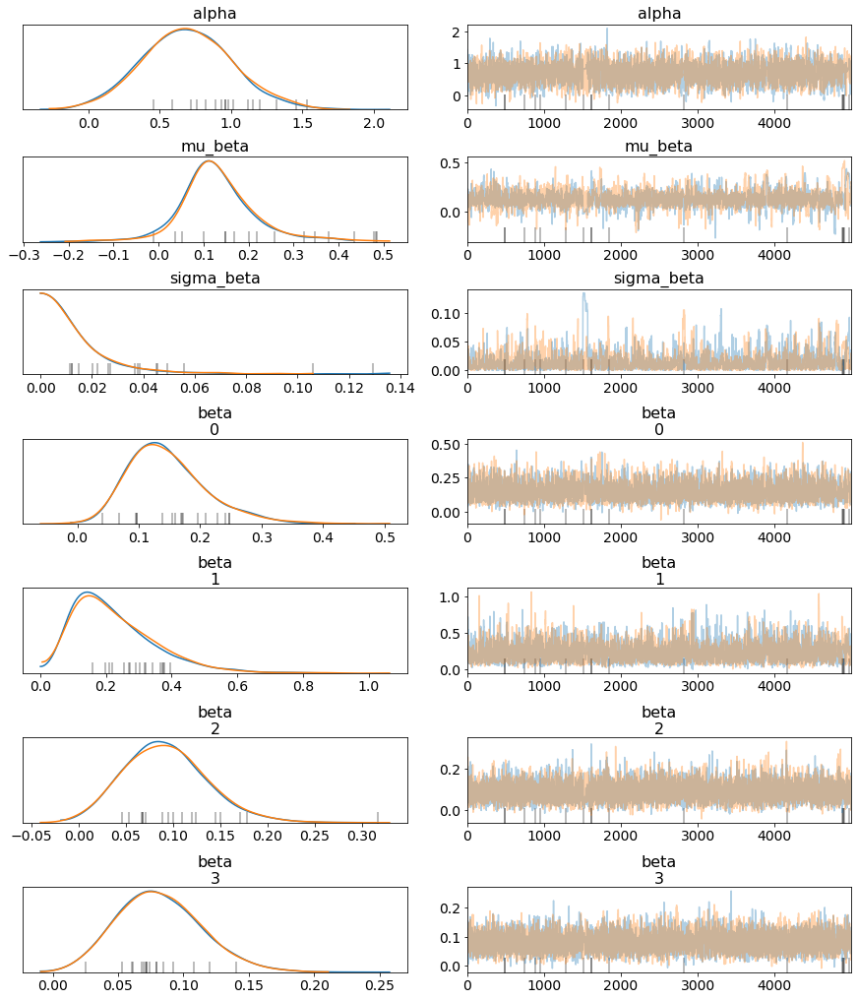


The traceplots look a lot better now, and there's less divergences popping up from Pymc3!


```
for i in [0,2,3]:
    prob = np.mean(hierarchical_trace_1['beta'][5000:,1] > hierarchical_trace_1['beta'][5000:,i]) # 
    print(f'The probably that beta_1 is larger than beta_{i} is {round(prob,2)}.')
```

    The probably that beta_1 is larger than beta_0 is 0.75.
    The probably that beta_1 is larger than beta_2 is 0.89.
    The probably that beta_1 is larger than beta_3 is 0.92.
    

Analyzing the summary and plots for the trace, it seems very likely that $\beta_1$ is larger than the other $\beta_i$'s. Therefore, for that group (where BMI < 25.0 and age >= 50), increased glucose levels is a bigger sign of risk for breast cancer than it is for the other groups.


```
WAICs['hierch_1'] = pm.waic(hierarchical_trace_1, hierarchical_model_1).WAIC
```

    /usr/local/lib/python3.6/dist-packages/ipykernel_launcher.py:1: FutureWarning: arrays to stack must be passed as a "sequence" type such as list or tuple. Support for non-sequence iterables such as generators is deprecated as of NumPy 1.16 and will raise an error in the future.
      """Entry point for launching an IPython kernel.
    /usr/local/lib/python3.6/dist-packages/pymc3/stats.py:219: UserWarning: For one or more samples the posterior variance of the
            log predictive densities exceeds 0.4. This could be indication of
            WAIC starting to fail see http://arxiv.org/abs/1507.04544 for details
            
      """)
    

As a final model, I build a simple multi-variate pooled logistic regression model using the most important variables as determined by Patricio et al.: resistin, glucose, age, and BMI.


```
X_train['resistin_c'] = (X_train.resistin - X_train.resistin.mean())
X_train['age_c'] = (X_train.age - X_train.age.mean())
X_train['bmi_c'] = (X_train.bmi - X_train.bmi.mean())
```


```
with pm.Model() as multivar_model:
    alpha = pm.Normal('alpha', mu=0, sd=10)
    b_age = pm.Normal('b_age', mu=0, sd=10)
    b_bmi = pm.Normal('b_bmi', mu=0, sd=10)
    b_glu = pm.Normal('b_glu', mu=0, sd=10)
    b_res = pm.Normal('b_res', mu=0, sd=10)

    age = pm.Data('age', X_train.age_c.values)
    bmi = pm.Data('bmi', X_train.bmi_c.values)
    glucose = pm.Data('glucose', X_train.glucose_c.values)
    resistin = pm.Data('resistin', X_train.resistin_c.values)

    mu = alpha + b_age*age + b_bmi*bmi + b_glu*glucose + b_res*resistin

    theta = pm.math.sigmoid(mu)

    outcome = pm.Bernoulli('outcome', p=theta, observed=(y_train.classification==2).values)

    multivar_trace = pm.sample(5000, tune=5000, init='auto', target_accept=0.9)
```

    Auto-assigning NUTS sampler...
    Initializing NUTS using jitter+adapt_diag...
    Sequential sampling (2 chains in 1 job)
    NUTS: [b_res, b_glu, b_bmi, b_age, alpha]
    100%|██████████| 10000/10000 [00:16<00:00, 617.09it/s]
    100%|██████████| 10000/10000 [00:15<00:00, 632.46it/s]
    


```
pm.summary(multivar_trace).round(2)
```

    /usr/local/lib/python3.6/dist-packages/pymc3/stats.py:991: FutureWarning: The join_axes-keyword is deprecated. Use .reindex or .reindex_like on the result to achieve the same functionality.
      axis=1, join_axes=[dforg.index])
    


<div>
<style scoped>
    .dataframe tbody tr th:only-of-type {
        vertical-align: middle;
    }

    .dataframe tbody tr th {
        vertical-align: top;
    }

    .dataframe thead th {
        text-align: right;
    }
</style>
<table border="1" class="dataframe">
  <thead>
    <tr style="text-align: right;">
      <th></th>
      <th>mean</th>
      <th>sd</th>
      <th>mc_error</th>
      <th>hpd_2.5</th>
      <th>hpd_97.5</th>
      <th>n_eff</th>
      <th>Rhat</th>
    </tr>
  </thead>
  <tbody>
    <tr>
      <th>alpha</th>
      <td>0.72</td>
      <td>0.33</td>
      <td>0.0</td>
      <td>0.09</td>
      <td>1.40</td>
      <td>10220.34</td>
      <td>1.0</td>
    </tr>
    <tr>
      <th>b_age</th>
      <td>-0.04</td>
      <td>0.02</td>
      <td>0.0</td>
      <td>-0.07</td>
      <td>0.00</td>
      <td>9325.21</td>
      <td>1.0</td>
    </tr>
    <tr>
      <th>b_bmi</th>
      <td>-0.10</td>
      <td>0.06</td>
      <td>0.0</td>
      <td>-0.22</td>
      <td>0.02</td>
      <td>10692.99</td>
      <td>1.0</td>
    </tr>
    <tr>
      <th>b_glu</th>
      <td>0.12</td>
      <td>0.03</td>
      <td>0.0</td>
      <td>0.06</td>
      <td>0.17</td>
      <td>8887.30</td>
      <td>1.0</td>
    </tr>
    <tr>
      <th>b_res</th>
      <td>0.04</td>
      <td>0.03</td>
      <td>0.0</td>
      <td>-0.02</td>
      <td>0.09</td>
      <td>8895.81</td>
      <td>1.0</td>
    </tr>
  </tbody>
</table>
</div>


The means for the coefficients in this model tells a consistent story as in the hierarchical model! The coefficients for age and bmi are negative, indicating that when glucose and resistin levels are constant, younger and skinnier people have lower odds of having breast cancer.


```
WAICs['multivar'] = pm.waic(multivar_trace, multivar_model).WAIC
```

    /usr/local/lib/python3.6/dist-packages/ipykernel_launcher.py:1: FutureWarning: arrays to stack must be passed as a "sequence" type such as list or tuple. Support for non-sequence iterables such as generators is deprecated as of NumPy 1.16 and will raise an error in the future.
      """Entry point for launching an IPython kernel.
    /usr/local/lib/python3.6/dist-packages/pymc3/stats.py:219: UserWarning: For one or more samples the posterior variance of the
            log predictive densities exceeds 0.4. This could be indication of
            WAIC starting to fail see http://arxiv.org/abs/1507.04544 for details
            
      """)
    

# Model Comparison

Now that these models are fit, I want to compare 3 of them: the pooled univariate mode (logreg_glucose)l, the hierarchical noncentered model (hierch_1), and the final multivariate model (multivar). 

First, a reminder on the architecture of each model:


```
pm.model_to_graphviz(pooled_model)
```


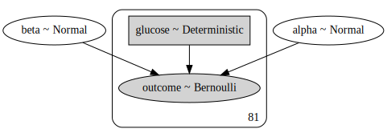


```
pm.model_to_graphviz(hierarchical_model_1)
```


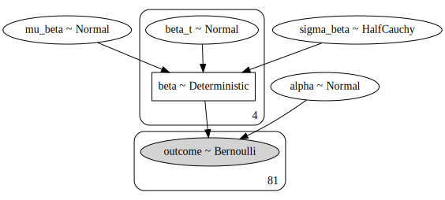


```
pm.model_to_graphviz(multivar_model)
```


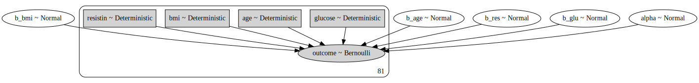


```
{k: WAICs[k] for k in ['logreg_glucose', 'hierch_1', 'multivar']}
```


    {'hierch_1': 93.01817957690675,
     'logreg_glucose': 92.93625741087507,
     'multivar': 95.4760982907023}


For two of the models, the WAIC is unreliable, so I'm not relying on it to inform my choice of the "best" model, but either way, the WAICs in this case for all the models are all very close.


```
ppc_1 = pm.sample_posterior_predictive(pooled_trace, model=pooled_model, samples=5000)
ppc_2 = pm.sample_posterior_predictive(hierarchical_trace_1, model=hierarchical_model_1, samples=5000)
ppc_3 = pm.sample_posterior_predictive(multivar_trace, model=multivar_model, samples=5000)
```

    100%|██████████| 5000/5000 [00:04<00:00, 1056.29it/s]
    100%|██████████| 5000/5000 [00:57<00:00, 86.94it/s]
    100%|██████████| 5000/5000 [00:05<00:00, 859.57it/s] 
    


```
from sklearn import metrics
fpr_1, tpr_1, thresholds_1 = metrics.roc_curve(np.array(y_train), ppc_1['outcome'].mean(axis=0), pos_label=2)
fpr_2, tpr_2, thresholds_2 = metrics.roc_curve(np.array(y_train), ppc_2['outcome'].mean(axis=0), pos_label=2)
fpr_3, tpr_3, thresholds_3 = metrics.roc_curve(np.array(y_train), ppc_3['outcome'].mean(axis=0), pos_label=2)
```


```
plt.plot(fpr_1, tpr_1, color='darkorange',
         lw=2, label= f'ROC curve (area = {round(metrics.auc(fpr_1, tpr_1), 2)})',
         )
plt.plot([0,1], [0,1], color='navy', lw=2, linestyle='--')
plt.xlim([0.,1.])
plt.ylim([0.,1.05])
plt.xlabel('False Positive Rate')
plt.ylabel('True Positive Rate')
plt.title('ROC Curve on Train Set (model 1)')
plt.legend(loc='lower right')
plt.show()
```


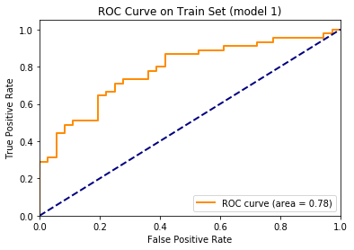


```
plt.plot(fpr_2, tpr_2, color='darkorange',
         lw=2, label= f'ROC curve (area = {round(metrics.auc(fpr_2, tpr_2), 2)})',
         )
plt.plot([0,1], [0,1], color='navy', lw=2, linestyle='--')
plt.xlim([0.,1.])
plt.ylim([0.,1.05])
plt.xlabel('False Positive Rate')
plt.ylabel('True Positive Rate')
plt.title('ROC Curve on Train Set (model 2)')
plt.legend(loc='lower right')
plt.show()
```


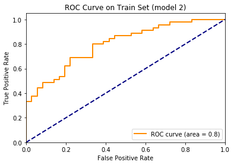


```
plt.plot(fpr_3, tpr_3, color='darkorange',
         lw=2, label= f'ROC curve (area = {round(metrics.auc(fpr_3, tpr_3), 2)})',
         )
plt.plot([0,1], [0,1], color='navy', lw=2, linestyle='--')
plt.xlim([0.,1.])
plt.ylim([0.,1.05])
plt.xlabel('False Positive Rate')
plt.ylabel('True Positive Rate')
plt.title('ROC Curve on Train Set (model 3)')
plt.legend(loc='lower right')
plt.show()
```


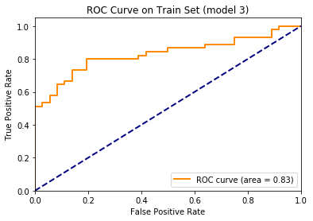


Again, the AUC of all 3 models is very similar, with the multivariate model having a slight advantage. However, the initial univariate model has the lowest AUC, and I also feel that it doesn't capture enough of the available information (e.g. interactions between age and glucose on cancer risk). To pick between the last two models, I evaluate them on the test set.


```
X_test['glucose_c'] = (X_test.glucose - X_train.glucose.mean()).astype(int) # subtracting with mean from training data to match scale that model was built on
X_test['agebmi_group'] = X_test[['age', 'bmi']].apply((lambda x: agebmi_group(x.age, x.bmi)), axis=1)
```


```
model_3_input.set_value(np.array(X_test[['agebmi_group', 'glucose_c']]))
model_3_output.set_value(np.zeros(len(X_test), dtype=bool))
```


```
ppc_hierch_test = pm.sample_posterior_predictive(hierarchical_trace_1, model=hierarchical_model_1, samples=5000)
```

    100%|██████████| 5000/5000 [00:54<00:00, 91.77it/s] 
    


```
X_test['resistin_c'] = (X_test.resistin - X_train.resistin.mean())
X_test['age_c'] = (X_test.age - X_train.age.mean())
X_test['bmi_c'] = (X_test.bmi - X_train.bmi.mean())
```


```
with multivar_model:
    pm.set_data({'age': X_test.age_c.values,
                 'bmi': X_test.bmi_c.values,
                 'glucose': X_test.glucose_c.values,
                 'resistin': X_test.resistin_c.values})
    
    ppc_multi_test = pm.sample_posterior_predictive(multivar_trace, samples=5000)
```

    100%|██████████| 5000/5000 [00:09<00:00, 505.87it/s]
    


```
fpr_hier, tpr_hier, thresholds_hier = metrics.roc_curve(np.array(y_test), ppc_hierch_test['outcome'].mean(axis=0), pos_label=2)
fpr_multi, tpr_multi, thresholds_multi = metrics.roc_curve(np.array(y_test), ppc_multi_test['outcome'].mean(axis=0), pos_label=2)
```


```
plt.plot(fpr_hier, tpr_hier, color='darkorange',
         lw=2, label= f'ROC curve (area = {round(metrics.auc(fpr_hier, tpr_hier), 2)})',
         )
plt.plot([0,1], [0,1], color='navy', lw=2, linestyle='--')
plt.xlim([0.,1.])
plt.ylim([0.,1.05])
plt.xlabel('False Positive Rate')
plt.ylabel('True Positive Rate')
plt.title('ROC Curve on Test Set (Hierarchical Model)')
plt.legend(loc='lower right')
plt.show()
```


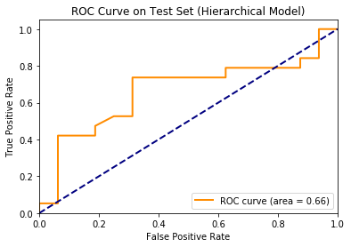


```
plt.plot(fpr_multi, tpr_multi, color='darkorange',
         lw=2, label= f'ROC curve (area = {round(metrics.auc(fpr_multi, tpr_multi), 2)})',
         )
plt.plot([0,1], [0,1], color='navy', lw=2, linestyle='--')
plt.xlim([0.,1.])
plt.ylim([0.,1.05])
plt.xlabel('False Positive Rate')
plt.ylabel('True Positive Rate')
plt.title('ROC Curve on Test Set (Multivariate Model)')
plt.legend(loc='lower right')
plt.show()
```


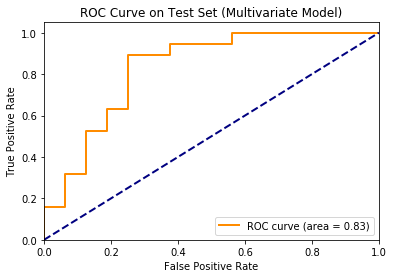


This final result shows that — despite a more intuitive explanation — the hierarchical model does not perform as well as the pooled multivariate model using more variable. This doesn't say that hierarchical models are definitively worse however, as the variables used differ between the two models (glucose, age, bmi vs. glucose, resistin, age, and bmi).  

Also, it is my opinion that when it comes to modeling, using the Bayesian frameworks feels a lot more intuitive when compared to more traditional frequentist approaches.
